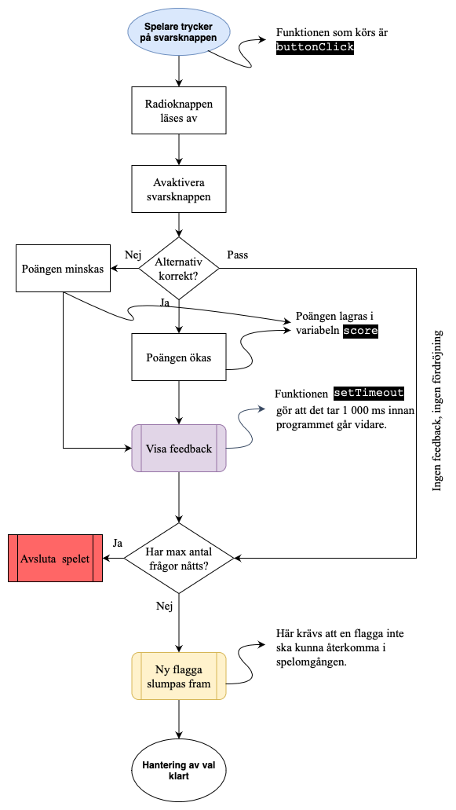
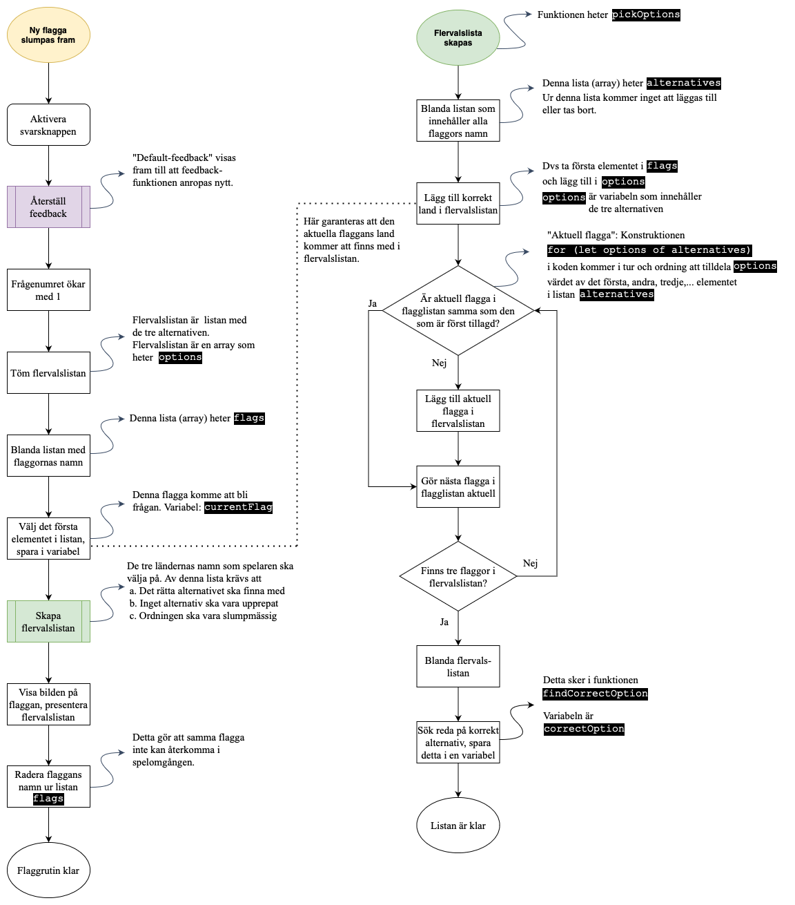
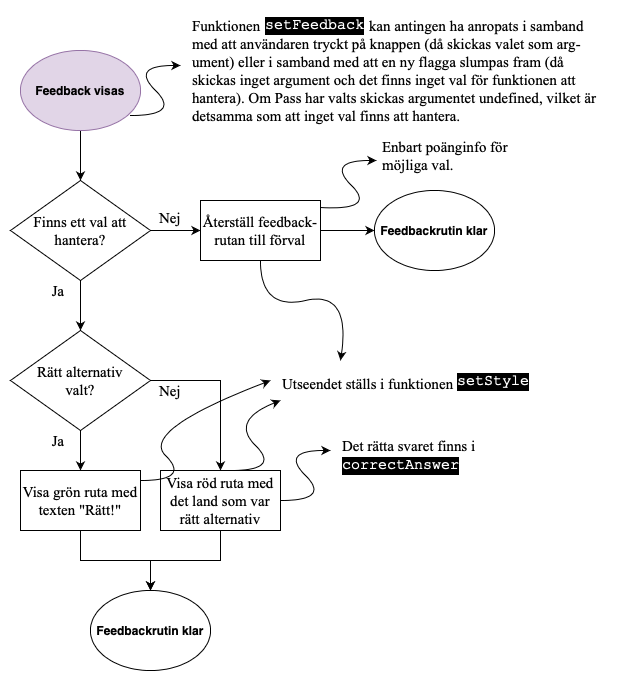
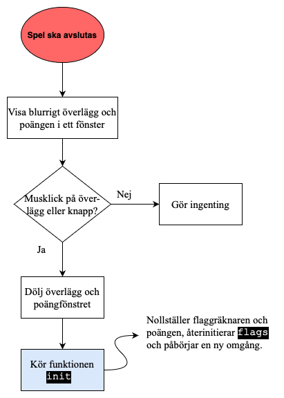

# Game of Flags

## Om programmet

Programmet kan köras i sin helhet [på denna länk](https://cloudheaven.se/~nikodemus/game-of-flags/).

Det här är ett JavaScript-projekt som jag har skapat för utbildningsändamål i kursen Programmering 1 på gymnasiet.
Ett syfte är att sätta in grundläggande strukturer i ett meningsfullt sammanhang. Sådana strukturer är i det här projektet t ex villkor, loopar och funktioner. Det är ju heller inte ett helt litet projekt, så vi ser också att det kommentarer och bra namn på variabler fyller sin funktion.

Tanken är att vi ska ha projektet som referens under en stor del av kursen och att eleverna ska kunna läsa och experimentera med koden för att lära sig under lång tid. Dessutom kan struktur och kod fungera som referens för andra projekt som kommer att genomföras under kursens gång.

En liten del av koden är lämnad som övning till eleverna. Det är anrop och implementering av funktionen som håller koll på antalet poäng under spelets gång, `updateScore`, som deklareras på rad 284 i filen [script.js](script.js).

En applikation i JavaScript består ofta av minst tre filer: en html-fil (som beskriver vad för typer av element/objekt som ska visas i webbläsaren), en css-fil (som beskriver de visade elementens utseende och läge i webbläsaren) och en JavaScript-fil (som beskriver hur elementen ska bete sig). De två förstnämnda filtyperna beskriver **gränssnittet** (innehåll och layout )för programmet. Det är framförallt beteendet (dvs JavaScript-filer) som vi kommer att arbeta med i kursen, men det är svårt att helt komma från arbete med gränssnittet.

Bilderna på flaggorna i mappen [bilder](bilder) är tagna från Wikipedia och har alla bredden 1024px.

## Flödesscheman

För att få en översikt av strukturen så är det vanligt att göra **flödesscheman** till programmet. Man bör skapa ett  utkast till flödesschema redan innan man skriver någon kod, men schemat kan naturligtvis justeras under arbetets gång. Dessa flödesscheman är gjorda i tjänsten [diagrams.net](https://diagrams.net).

