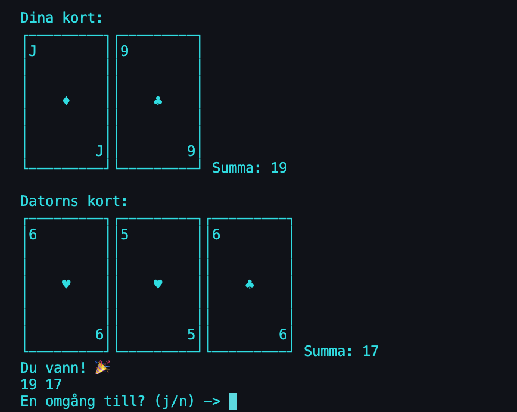
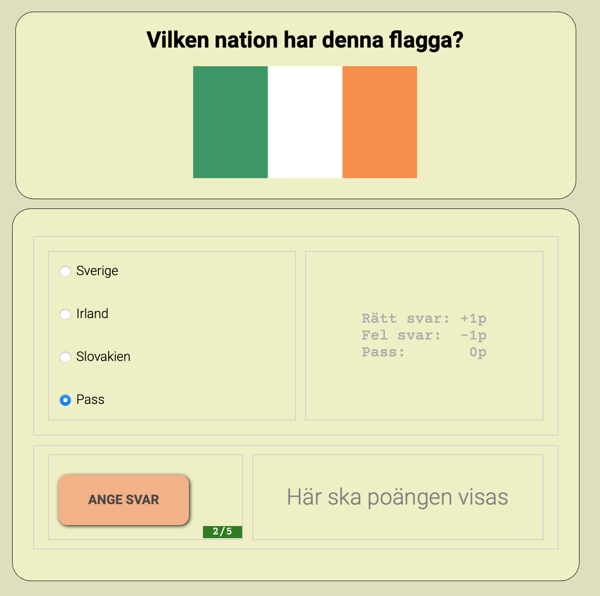

# Referensprojekt i Programmering 1

För att underlätta såväl egna genomgångar och elevers egna projekt i kursen Programmering 1 så har jag skapat två små spel som kan tjäna som referensprojekt; ett i Python (som körs i konsol/terminalfönster) och ett i JavaScript (som körs i webbläsare). Projekten är

* [BlackJack](BlackJack) (Python)
* [Game Of Flags](GameOfFlags) (JavaScript)

Det som åtminstone är kvar att göra är att skapa flödesschema för BlackJack.

## BlackJack

)

## Game of Flags

